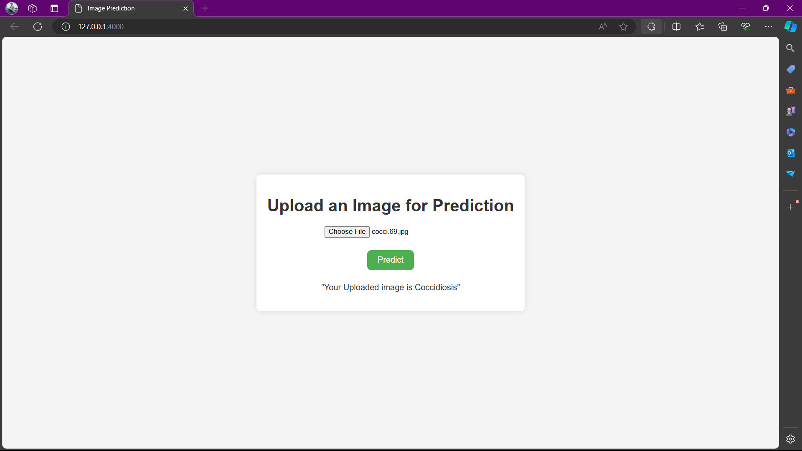

# Disease Classification

This repository contains the code and resources for an end-to-end machine learning project aimed at classifying diseases from medical images. This project uses DVC (Data Version Control) to manage the pipelines and the VGG16 model for image classification.

## Preview


## Overview

The project focuses on predicting whether a subject is healthy or has a specific disease (e.g., Coccidiosis) using machine learning techniques. It involves several stages including data ingestion, model selection, training, evaluation, and deployment.

## Project Structure

The project is structured as follows:

- `config/config.yaml`: Contains the path configuration for the stages in the pipeline.
- `src/components`: Contains methods for data ingestion, model tuning, model training, and evaluation.
- `src/config`: Configuration manager to retrieve necessary settings from `config.yaml` and `params.yaml`.
- `src/pipeline`: Contains pipelines for stages involved in the machine learning process.
- `src/utils`: Common utility functions reused throughout the project.
- `templates/`: HTML templates for the web interface.
- `app.py`: Flask application for model deployment and prediction.
- `Dockerfile`: Docker configuration for containerizing the application.
- `dvc.yaml`: Data Version Control file to handle pipelines for this project.
- `main.py`: Script to run all the pipelines from scratch.
- `params.yaml`: Contains parameters for data augmentation, model configuration, and training.
- `requirements.txt`: File containing the necessary dependencies to run the project.


## Getting Started

To get started with the project, follow these steps:

1. Clone this repository to your local machine.
    ```bash
    git clone https://github.com/RiteshYennuwar/ETE_Disease_Classification.git
    cd ETE_Disease_Classification
2. Install the required dependencies using 
    ```bash
    pip install -r requirements.txt

## Usage

- **Flask App**: Run the Command
    ```bash
    python app.py

This will run the dvc pipeline to train the model along with data ingestion and model evaluation.

Then navigate to http://127.0.0.1:4000 to run the app in the local browser

make sure to upload the image of the chicken fecal that you suspect to have Coccidiosis disease

## Docker Setup

To containerize the application and run it using Docker, follow these steps:

1. Build the Docker image:
    ```sh
    docker build -t disease-classification-app .
    ```
2. Run the Docker container:
    ```sh
    docker run -p 4000:4000 disease-classification-app
    ```
3. Access the web interface at `http://localhost:4000`.

### Contributing

Contributions are welcome! If you'd like to contribute to this project, feel free to submit a pull request.